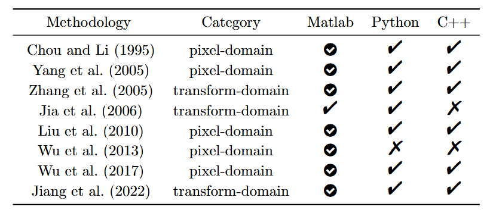
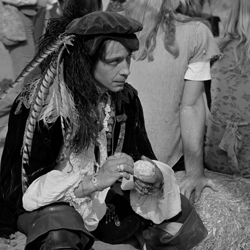
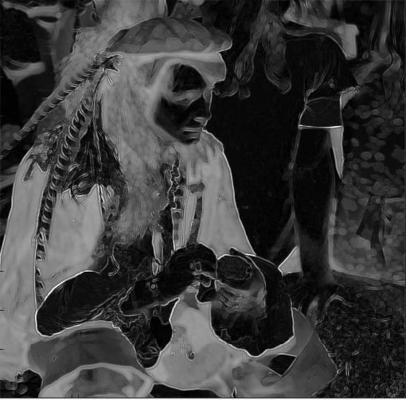
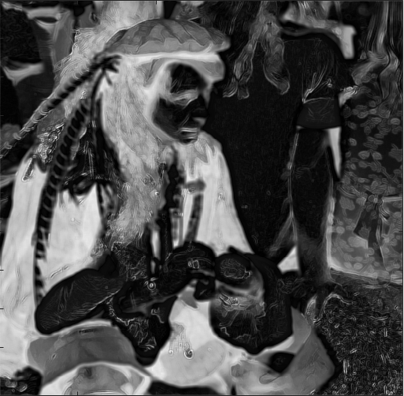
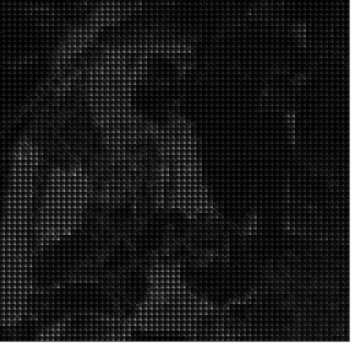
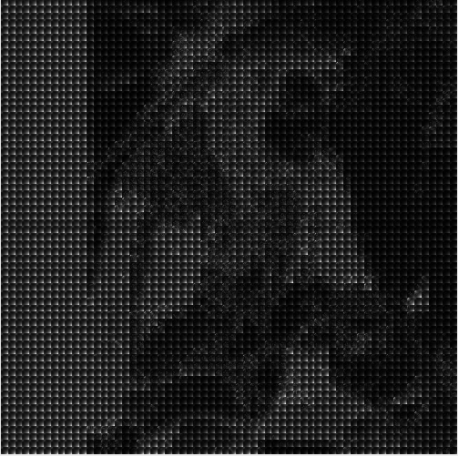
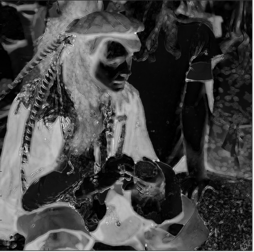
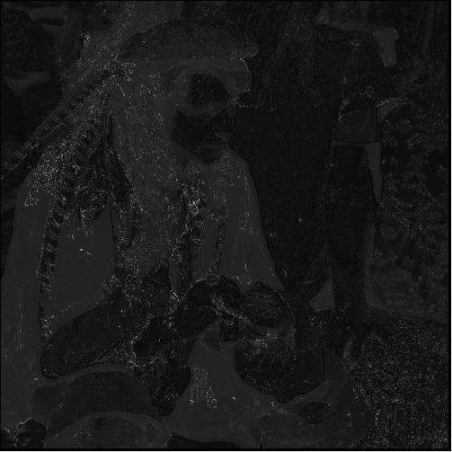
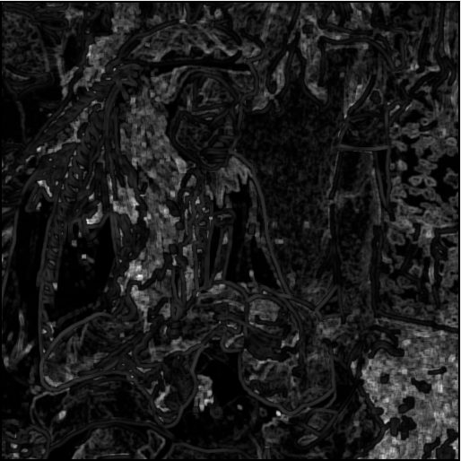
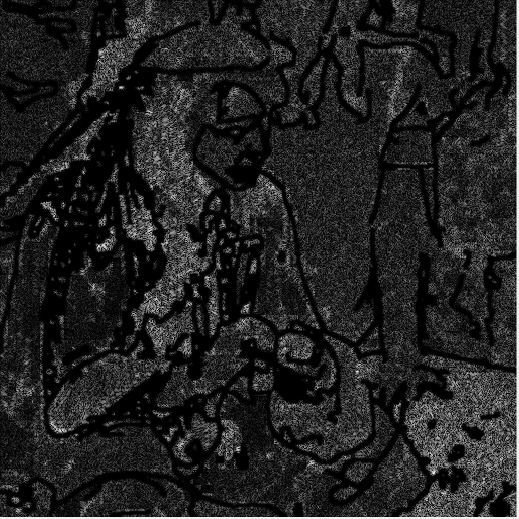

# OpenJND
OpenJND is an Open-Source Algorithm Library of Just Noticeable Difference (JND). We collect methods on JND, provide source codes of Matlab, Python, C++, and test their performance.

## Contact and References
Coordinator: Asst. Prof. Wei Gao (Shenzhen Graduate School, Peking University)
Should you have any suggestions for better constructing this open source library, please contact the coordinator via Email: gaowei262@pku.edu.cn. We welcome more participants to submit your codes to this collection, and you can send your OpenI ID to the above Email address to obtain the accessibility.

## List of Contributors
Contributors:
Asst. Prof. Wei Gao (Shenzhen Graduate School, Peking University)
Mr. Wenxu Gao (Shenzhen Graduate School, Peking University)
Mr. Changhao Peng (Shenzhen Graduate School, Peking University)
Miss. Jingxuan Su (Shenzhen Graduate School, Peking University)
etc.

## Motivation
Just Noticeable Difference (JND), a fundamental concept in psychophysics, represents the the minimal perceptible change in visual stimuli, encapsulating the sensitivity threshold of the Human Visual System (HVS). To elucidate its underlying rationale, a variety of JND methods have been proposed and validated. Nevertheless, current research is often limited in scope and lacks consistent reliability. To address this gap, we present OpenJND, the first comprehensive open-source JND algorithm library, integrating eight representative methods. Considering the differences in programming languages and the variations in applicable diverse requirements, this algorithm library is implemented across three programming systems (Matlab, Python, C++), which significantly enhances cross-platform compatibility and verifiability. Furthermore, we seamlessly use the JND library to conduct a comparative analysis of different methods, yielding insightful and interpretable conclusions that promote the advancement and widespread adoption of JND-related research and applications.

## Model Zoo

## Evaluation Data
To ensure a fair comparison of algorithms in the OpenJND library, we established a benchmark using the grayscale "Actor" image with a pixel size of 512×512 as the test input.

## Chou et al.

Chou et al. proposed a perceptually tuned image coding scheme that leverages JND or minimally noticeable distortion (MND) profiles to quantize and eliminate perceptual redundancy in image signals. The proposed perceptual model integrates threshold sensitivity, driven by luminance adaptation and texture masking effects, to estimate JND/MND profiles. Additionally, a novel fidelity metric, peak signal-to-perceptible-noise ratio (PSPNR), is introduced to evaluate the quality of compressed images by accounting for the perceptible components of distortion. JND Visualization:

## Yang et al.

Yang et al. introduced a novel JND estimation model, termed the nonlinear additive masking model (NAMM), which incorporates luminance adaptation, texture masking, and temporal masking across color channels. Moreover, they integrated NAMM-derived JND profiles into the video coding framework to guide motion estimation and residual filtering, thereby improving perceptual quality and objective coding metrics, such as PSNR. JND Visualization:

## Zhang et al.

Zhang et al. put forward a novel luminance adaptation adjustment formula and introduced block classification for contrast masking. This model addresses the limitations of previous approaches by more accurately modeling the human visual system's sensitivity in dark and bright regions. Additionally, by classifying image blocks to determine enhancement factors, it avoids overestimating the contrast masking effect in edge regions. JND Visualization:

## Jia et al.

Jia et al. proposed a method for estimating JND in the discrete cosine transform (DCT) domain, applicable to both images and videos. The model integrates spatial-temporal contrast sensitivity functions (CSF), the influence of eye movements, luminance adaptation, and contrast masking to better align with human perception. The proposed approach generates JND profiles for both still images and videos with significant motion. JND Visualization:

## Liu et al.

Liu et al. presented an enhanced pixel-domain JND model that improves contrast masking (CM) estimation by separately addressing edge masking (EM) and texture masking (TM). The key innovation lies in employing total variation (TV)-based image decomposition to split the input image into a structural image (for EM estimation) and a texture image (for TM estimation). This approach enables more accurate differentiation between EM and TM, which is critical for JND estimation, as texture regions are often misclassified as edges in existing models. JND Visualization:

## Wu et al.

Wu et al. advanced a novel JND estimation model based on the free energy principle, designed to better capture the effects of disorder in human visual perception. Previous JND models primarily focused on ordered factors, often underestimating JND thresholds in disordered regions. The proposed model employs an autoregressive (AR) approach to predict the ordered content of an image, subsequently calculating JND thresholds for ordered and disordered components separately. JND Visualization:

## Wu et al.

Wu et al. proposed an enhanced JND model that incorporates the pattern complexity of visual content in addition to luminance contrast. The key concept is to quantify the complexity of visual patterns by measuring the diversity of orientations in local regions, serving as an effective indicator of visual masking. The proposed model derives a novel spatial masking estimation function that accounts for both pattern complexity and luminance contrast, yielding a more perceptually accurate JND estimation. JND Visualization:

## Jiang et al.

Jiang et al. presented a top-down approach for estimating JND in natural images. The core idea is to first predict the critical perceptually lossless (CPL) counterpart of the original image and then compute the difference map between the original and CPL images as the JND map. Subjective experiments were conducted to identify critical points in 500 images, revealing that the cumulative normalized KLT coefficient energy distribution at these points can be effectively modeled using a Weibull distribution. JND Visualization:

## Running Time Evaluation

We evaluated the running time performance of various models across different programming languages (Matlab, Python, and C++). The results reveal distinct patterns. For Chou’s and Yang’s models, the runtime order is Matlab < Python < C++. This is likely because explicit loops in the JND calculations in Python and C++ are not vectorized. For Zhang’s model, the runtime order is Matlab < C++ < Python, which may be attributed to Matlab’s use of highly efficient libraries like Intel MKL, providing hardware-level optimizations for operations in the model such as DCT, while Python’s slower performance stems from interpreter overhead and suboptimal NumPy/SciPy optimizations. For Jia’s model, Matlab and Python exhibit comparable runtimes, highlighting the model’s robustness across programming frameworks. For Liu’s and Jiang’s models, Python significantly outperforms C++ and Matlab. In Liu’s model, our ported Python implementation employs a simple Gaussian blur instead of the computationally intensive graph-cut decomposition used in Matlab, thereby reducing algorithmic complexity. For Jiang’s model, our ported Python version benefits from highly optimized NumPy and OpenCV libraries with vectorized operations. Although C++ outperforms Matlab in Jiang’s model by leveraging the efficient OpenCV library, its principal component analysis (PCA) and loop implementations may not be fully optimized. For Wu’s model, the runtime order is Python < Matlab < C++. This may result from the C++ implementation’s limited use of vectorization, coupled with overhead from OpenMP parallelization and performance degradation due to dynamic memory allocation and multiple function calls.
