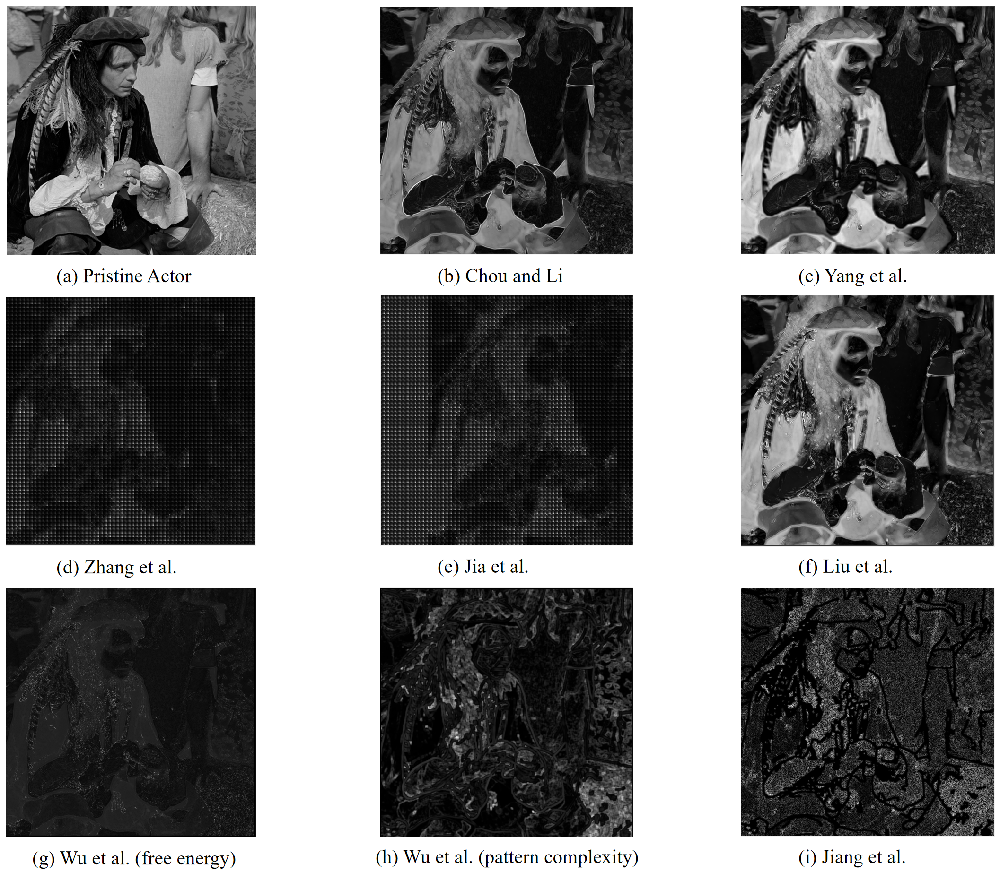
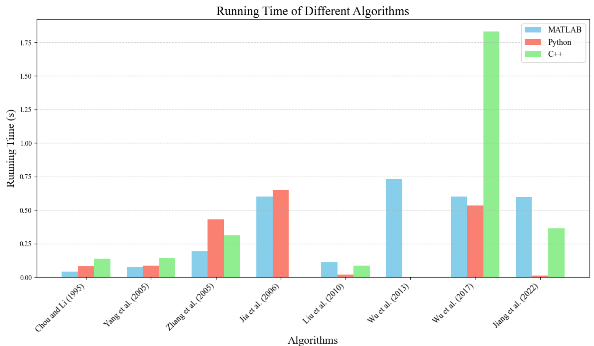

<div align="center">


**A Cross-Language Reference Library for Visual Just-Noticeable-Difference Estimation**

[](#license)
[](#)
[](#)
[](#)
[](#method-index)
[](https://openi.pcl.ac.cn/OpenDatasets/OpenJND?lang=en-US)
[](https://github.com/Terriao/OpenJND/issues)

**🔗 GitHub:** <https://github.com/Terriao/OpenJND>

**🪞 OpenI Mirror:** <https://openi.pcl.ac.cn/OpenDatasets/OpenJND?lang=en-US>

</div>

---

## What this library is

OpenJND is a **reference implementation collection** of eight representative Just-Noticeable-Difference (JND) models for visual content, made available under a single calling convention in **MATLAB**, **Python**, and **C++**.

The library is built around three observations the field has tolerated for too long:

1. **JND code lives where its author put it.** Reference code typically ships as a single MATLAB folder bundled with the original publication. Re-running it later, or porting it into a Python/C++ pipeline, is each user's private headache.
2. **There is no shared yardstick.** Different works report on different test images at different resolutions, sometimes with bespoke metrics. Reading them in sequence does not give a consistent picture of which method does what.
3. **Method choice is more nuanced than "newest wins".** Pixel-domain and transform-domain models answer different questions, and the right choice depends on the downstream task (codec, watermarking, rendering, IQA). Foundational models are often still the right answer in production pipelines.

OpenJND addresses all three by re-implementing each method against a fixed I/O contract, evaluating the eight models on the same input, and documenting both the *idea* and the *cost* of every model.

> The library accompanies the paper *"OpenJND: A Comprehensive Open Source Library for Just Noticeable Difference"* (ACM MM 2026, under review). See [Citation](#citation).

---

## Contents

1. [Concept primer](#concept-primer)
2. [Methodological lineage](#methodological-lineage)
3. [Method index](#method-index)
4. [Unified calling convention](#unified-calling-convention)
5. [Method catalogue](#method-catalogue)
6. [Evaluation protocol](#evaluation-protocol)
7. [Qualitative comparison](#qualitative-comparison)
8. [Runtime analysis](#runtime-analysis)
9. [Choosing a method](#choosing-a-method)
10. [Getting started](#getting-started)
11. [Extending the library](#extending-the-library)
12. [Roadmap](#roadmap)
13. [Frequently asked questions](#frequently-asked-questions)
14. [Citation](#citation)
15. [License](#license)
16. [Acknowledgements](#acknowledgements)
17. [Contributors and contact](#contributors-and-contact)

---

## Concept primer

A **Just-Noticeable-Difference (JND)** threshold is the minimum signal change that a human observer can reliably detect. In the visual domain, it is determined by the Human Visual System (HVS) reacting to factors such as background luminance, local contrast, edge structure, texture density, pattern regularity, and (for video) motion. Below the threshold, modifications are perceptually invisible; above it, they become noticeable distortions.

Computational JND modelling produces a **JND map** — one threshold per pixel (pixel-domain models) or per transform coefficient (transform-domain models) — that downstream systems can use as a *budget* for invisible modification:

- **Compression** spends bitrate first where the JND budget is smallest.
- **Watermarking** embeds energy just below the JND boundary: invisible, but hard to remove.
- **Quality assessment** weights distortions by their visibility instead of their raw magnitude.
- **Rendering** (VR/AR, HDR) allocates compute where the eye actually looks.

Two methodological families dominate the literature:

| Family | Operating domain | Strengths | Typical limitations |
|--------|------------------|-----------|---------------------|
| Pixel-domain | Original image plane | Intuitive, edge/texture-aware, codec-agnostic | Edges and textures can be conflated; no native frequency story |
| Transform-domain | DCT / DWT / KLT coefficients | Plugs directly into block-based codecs, principled CSF | Block artefacts in the JND map; harder to interpret pixel-wise |

OpenJND covers both — five pixel-domain models and three transform-domain models.

---

## Methodological lineage

JND modelling has matured along a clear intellectual trajectory. Each model in the library answers a question that the previous generation could not — and being part of an established lineage is precisely why these models continue to anchor modern perceptual codecs, watermarking schemes, and IQA systems. The library presents them as a working catalogue rather than a chronology:

```
Foundational           →  Chou & Li
   ├─ Temporal extension  →  Yang et al.
   ├─ Subband refinement  →  Zhang et al.
   └─ DCT formulation     →  Jia et al.

Decomposition era       →  Liu et al.            (separates edge / texture)

Cognitive-inspired      →  Wu et al. (free energy)   (predicts ordered content)

Pattern-aware           →  Wu et al. (pattern complexity)  (orientation diversity)

Top-down learning       →  Jiang et al.          (data-driven CPL boundary)
```

The lineage is **converging, not branching**: later models do not invalidate earlier ones, they sharpen specific aspects. Several state-of-the-art codecs in production today still call into Chou-style or Zhang-style estimators for their simplicity and codec-locality, while research pipelines combine them with the cognitive- and pattern-aware refinements. OpenJND ships all generations so the user can pick the right tool, not the most recent one.

---

## Method index

| # | Method | Lineage | Domain | Distinguishing idea | MATLAB | Python | C++ |
|---|--------|---------|--------|---------------------|:------:|:------:|:---:|
| 5.1 | [Chou & Li](#51-chou--li) | Foundational | Pixel | Luminance adaptation + texture masking; introduces PSPNR | ● | ◐ | ◐ |
| 5.2 | [Yang et al.](#52-yang-et-al) | Temporal extension | Pixel | NAMM with temporal masking, multi-component | ● | ◐ | ◐ |
| 5.3 | [Zhang et al.](#53-zhang-et-al) | Subband refinement | Transform | Refined luminance curve + block-classified CM | ● | ◐ | ◐ |
| 5.4 | [Jia et al.](#54-jia-et-al) | DCT formulation | Transform (DCT) | Spatio-temporal CSF with eye-movement compensation | ◐ | ◐ | — |
| 5.5 | [Liu et al.](#55-liu-et-al) | Decomposition era | Pixel | TV decomposition separating edge and texture masking | ● | ◐ | ◐ |
| 5.6 | [Wu et al. (free energy)](#56-wu-et-al-free-energy) | Cognitive-inspired | Pixel | AR prediction splits ordered vs. disordered regions | ● | — | — |
| 5.7 | [Wu et al. (pattern complexity)](#57-wu-et-al-pattern-complexity) | Pattern-aware | Pixel | Orientation diversity as masking strength | ● | ◐ | ◐ |
| 5.8 | [Jiang et al.](#58-jiang-et-al) | Top-down learning | Transform (KLT) | Data-driven CPL prediction | ● | ◐ | ◐ |

Legend — ● upstream open-source reference; ◐ this repository's ported implementation; — not yet implemented.

---

## Unified calling convention

Every method in the library exposes the same minimal interface across all three languages:

```
INPUT  : grayscale image            (uint8 / float, H × W)
         optional config dictionary (struct in MATLAB, dict in Python, std::map in C++)
OUTPUT : JND map of the same H × W shape (float, same range as input)
```

A method-specific config exposes only the parameters that genuinely matter for that method (e.g. `theta` for Chou's masking, `block_size` for DCT-based methods). Default values reproduce the numbers reported in the original publication.

This design lets you swap methods by changing a single function name — invaluable for ablations and downstream-task benchmarking.

---

## Method catalogue

For each method we give the context that motivated it, the modelling step that distinguishes it from its predecessors, and a one-line characterisation of the JND map it produces. Bibliographic details (including publication year) are listed at the end of each entry for citation.

### 5.1 Chou & Li

> **Foundational pixel-domain model** · luminance adaptation + texture masking

The cornerstone pixel-domain JND model around which the rest of the catalogue is organised. It estimates a per-pixel visibility budget from two HVS factors — how bright the background is (luminance adaptation), and how busy the local neighbourhood is (texture masking) — and uses the maximum of the two as the local JND threshold. The companion paper also introduces **PSPNR**, a fidelity metric that ignores distortion components falling below the threshold.

Behaviour of the resulting map: large budgets on dark and on busy regions; relatively conservative near isolated edges, where the max-rule tends to over-allocate.

```bibtex
@article{chou1995perceptually,
  title   = {A perceptually tuned subband image coder based on the measure of just-noticeable-distortion profile},
  author  = {Chou, Chun-Hsien and Li, Yun-Chin},
  journal = {IEEE Transactions on Circuits and Systems for Video Technology},
  volume  = {5}, number = {6}, pages = {467--476}, year = {1995}
}
```

### 5.2 Yang et al.

> **Temporal extension of the foundational model** · nonlinear additive masking · video-aware

Recasts the foundational max-rule as a **nonlinear additive masking model (NAMM)** that combines luminance, texture, and a new **temporal masking** term across colour components. The additive-but-nonlinear combination avoids the double-counting that pure summation causes, while the temporal term lets the model travel from still images to video. The authors plug it into a video codec to demonstrate gains in motion estimation and residual filtering.

Behaviour: smoother handling of edges than the max-rule, and the only model in the catalogue with a native temporal pathway.

```bibtex
@article{yang2005just,
  title   = {Just noticeable distortion model and its applications in video coding},
  author  = {Yang, Xiaokang and Lin, Weisi and Lu, Zhongkang and Ong, Ee Ping and Yao, Susu},
  journal = {Signal Processing: Image Communication},
  volume  = {20}, number = {7}, pages = {662--680}, year = {2005}
}
```

### 5.3 Zhang et al.

> **Subband refinement** · refined luminance · block-classified contrast masking

Addresses two long-standing weaknesses of subband JND modelling: an inaccurate luminance-adaptation curve at very dark and very bright extremes, and an over-aggressive contrast-masking gain in edge blocks. A new luminance-adaptation formula and an explicit **block classification** step (edge / texture / smooth) scale the masking gain differently per category. The resulting JND profile is markedly more conservative near edges, eliminating a class of visible artefacts that earlier subband coders produced.

Behaviour: the JND map carries the imprint of the block grid by construction; suitable for codecs that already operate block-wise.

```bibtex
@article{zhang2005improved,
  title   = {Improved estimation for just-noticeable visual distortion},
  author  = {Zhang, Xiaohui and Lin, Weisi and Xue, Ping},
  journal = {Signal Processing},
  volume  = {85}, number = {4}, pages = {795--808}, year = {2005}
}
```

### 5.4 Jia et al.

> **DCT-domain formulation** · spatio-temporal CSF · eye-movement-aware

The first model in the catalogue designed natively in the DCT domain that the codecs themselves use. Combines **spatial and temporal contrast sensitivity functions** with corrections for the smooth-pursuit eye movements a viewer makes when tracking moving content. The output is a per-coefficient threshold map applicable to both still frames and frame pairs with motion.

Behaviour: when applied to a frame pair with translation, the JND map cleanly reflects both the motion field and the underlying 8×8 block structure — a useful diagnostic property.

```bibtex
@article{jia2006estimating,
  title   = {Estimating just-noticeable distortion for video},
  author  = {Jia, Yuting and Lin, Weisi and Kassim, Ashraf A.},
  journal = {IEEE Transactions on Circuits and Systems for Video Technology},
  volume  = {16}, number = {7}, pages = {820--829}, year = {2006}
}
```

### 5.5 Liu et al.

> **Decomposition era** · TV-based edge/texture separation

Earlier contrast-masking estimators tend to lump strong gradients into a single "high-frequency" bucket, so textured regions are routinely *misclassified as edges* and assigned an artificially low budget. Liu et al. propose a clean fix: split the image into a **structural component** (used for edge masking) and a **textural component** (used for texture masking) via **total-variation decomposition**, then estimate the two masking terms from the two components independently.

Behaviour: textures recover their rightful, generous JND budget; edges remain protected. The cost is a non-trivial decomposition step — see the runtime section for how each language port handles it.

```bibtex
@article{liu2010just,
  title   = {Just noticeable difference for images with decomposition model for separating edge and textured regions},
  author  = {Liu, Anmin and Lin, Weisi and Paul, Manoranjan and Deng, Chenwei and Zhang, Fan},
  journal = {IEEE Transactions on Circuits and Systems for Video Technology},
  volume  = {20}, number = {11}, pages = {1648--1652}, year = {2010}
}
```

### 5.6 Wu et al. (free energy)

> **Cognitive-inspired** · free-energy principle · ordered vs. disordered split

A conceptually distinct entry in the catalogue. Drawing on the free-energy framework from theoretical neuroscience, the HVS is modelled as attempting to *predict* the orderly content of an image; whatever cannot be predicted is **disordered** content that the eye tolerates much more freely. An **autoregressive predictor** fits the image, the residual is treated as disorder, and JND is computed separately for ordered and disordered components.

Behaviour: substantially elevated JND in disordered regions (foliage, fabric, noise), while ordered regions stay conservative. Currently MATLAB-only in this repository.

```bibtex
@article{wu2013just,
  title   = {Just noticeable difference estimation for images with free-energy principle},
  author  = {Wu, Jinjian and Shi, Guangming and Lin, Weisi and Liu, Anmin and Qi, Fei},
  journal = {IEEE Transactions on Multimedia},
  volume  = {15}, number = {7}, pages = {1705--1710}, year = {2013}
}
```

### 5.7 Wu et al. (pattern complexity)

> **Pattern-aware** · orientation diversity

Contrast alone is a poor predictor of masking strength: two regions with identical contrast can mask very different amounts of distortion depending on whether their local patterns are *regular* (e.g. a brick wall) or *irregular* (e.g. crumpled fabric). **Pattern complexity** is quantified here as the diversity of local orientations and combined with luminance contrast in a new spatial-masking estimator.

Behaviour: irregular-pattern regions receive a higher JND budget than regular-pattern regions of the same contrast. A natural successor to texture-masking models for high-resolution natural imagery.

```bibtex
@article{wu2017enhanced,
  title   = {Enhanced just noticeable difference model for images with pattern complexity},
  author  = {Wu, Jinjian and Li, Leida and Dong, Weisheng and Shi, Guangming and Lin, Weisi and Kuo, C.-C. Jay},
  journal = {IEEE Transactions on Image Processing},
  volume  = {26}, number = {6}, pages = {2682--2693}, year = {2017}
}
```

### 5.8 Jiang et al.

> **Top-down learning** · data-driven CPL prediction · KLT-domain

The catalogue's only *top-down* model. Instead of summing low-level masking factors, the model asks the more direct question: *at what point does distortion start to be noticed?* Subjective experiments on 500 natural images locate this **critical perceptually-lossless (CPL)** point for each image; the cumulative normalised KLT-coefficient energy at the CPL is well approximated by a Weibull distribution. For a new image, the model predicts its CPL counterpart and reports the difference map as JND.

Behaviour: low budgets near edges (where humans really do notice distortion early) and high budgets in busy textured regions — qualitatively consistent with the bottom-up models, but reached by a completely different route.

```bibtex
@article{jiang2022toward,
  title   = {Toward top-down just noticeable difference estimation of natural images},
  author  = {Jiang, Qiuping and Liu, Zhentao and Wang, Shiqi and Shao, Feng and Lin, Weisi},
  journal = {IEEE Transactions on Image Processing},
  volume  = {31}, pages = {3697--3712}, year = {2022}
}
```

---

## Evaluation protocol

To keep the comparison reproducible:

- **Image pool.** The 24 colour images of the **Kodak** photographic dataset, converted to grayscale, together with three classical grayscale test images (`Lena`, `Actor`, `Lighthouse`). All images are resized to 512 × 512 when their native resolution differs.
- **Aggregation.** Runtime is reported as the **mean over the full pool**, on a fixed hardware platform.
- **Visualisation.** A single image — grayscale `Actor` (512 × 512) — is shown for every method, side by side, so the reader can compare maps at a glance.
- **Defaults.** Every method is run with the parameter settings reported in its original publication.

We deliberately do *not* report a single "winner" metric: JND maps are intermediate signals, and the right yardstick depends on the downstream application (compression bitrate, watermark robustness, IQA correlation, …). Application-specific benchmarks live in `benchmarks/` and can be invoked individually.

---

## Qualitative comparison

The figure below tiles the JND maps produced by all eight methods on the same `Actor` input. A few reading notes:

- Bottom-up pixel-domain models tend to agree on the *shape* of the map but disagree on the *amplitude* in edge and texture regions.
- The two transform-domain bottom-up models (Zhang, Jia) carry the imprint of the underlying block grid by construction — a feature, not a bug, when the downstream consumer is a block-based codec.
- Jiang et al.'s top-down map looks qualitatively similar to the bottom-up consensus despite being derived without explicit masking decomposition — evidence that the two philosophies converge on broadly consistent perceptual budgets.

<p align="center"></p>

---

## Runtime analysis

Each method is run in MATLAB, Python, and C++ on the same hardware and the same image pool. The figure below shows the average per-image runtime for each (method × language) pair.

<p align="center"></p>

The qualitative findings:

| Pattern | Methods | Why |
|---------|---------|-----|
| MATLAB < Python ≈ C++ | Chou, Yang | The reference code is loop-heavy; MATLAB JIT-vectorises these loops automatically while our untuned Python/C++ ports do not. |
| MATLAB < C++ < Python | Zhang | DCT-bound. MATLAB calls Intel MKL; the Python DCT goes through SciPy/NumPy and pays interpreter overhead. |
| MATLAB ≈ Python | Jia | Workload is well-balanced across primitives, so the two stacks tie. |
| Python < C++ < MATLAB | Liu, Jiang | The Python port substitutes a Gaussian-blur surrogate for Liu's graph-cut decomposition, and leans on highly tuned OpenCV/NumPy routines for Jiang's PCA. |
| Python < MATLAB < C++ | Wu (pattern complexity) | Vectorisation pays off in Python; the C++ port suffers from OpenMP synchronisation and per-block allocation overhead. |

Two takeaways:

1. **"C++ is always fastest" is folklore.** For numerical-array workloads dominated by BLAS / DCT / image primitives, MATLAB or vectorised Python regularly beats hand-rolled C++.
2. **Port fidelity matters as much as language.** Where we deliberately simplified a costly step (graph-cut in Liu) we say so explicitly; the numbers are honest about the trade.

---

## Choosing a method

A rough decision tree for downstream users:

| If your application is … | Start with … |
|---|---|
| Still-image compression, codec-agnostic | Wu (pattern complexity) or Liu |
| Block-based codec (JPEG, HEVC, AVS) | Zhang or Jia |
| Video coding with motion compensation | Yang or Jia |
| Watermarking with imperceptibility constraint | Wu (free energy) or Wu (pattern complexity) |
| IQA / perceptual quality metric design | Jiang (top-down) for alignment with subjective tests |
| Teaching / first reproducible baseline | Chou (the most thoroughly documented foundational model) |

When in doubt, run **all eight** through `benchmarks/jnd_grid.py` on a few of your own images and inspect the maps. Visual inspection at this stage saves a lot of downstream confusion.

---

## Getting started

### Clone

```bash
git clone https://github.com/Terriao/OpenJND.git
cd OpenJND
```

### MATLAB

```matlab
addpath(genpath('matlab'));
img = imread('test_data/actor.png');
jnd = chou(img);            % any of: chou, yang, zhang, jia, liu, wu_fe, wu_pc, jiang
imshow(jnd, []);
```

### Python

```bash
cd python
pip install -r requirements.txt
python -m openjnd.cli --method wu_pc --input ../test_data/actor.png --output wu_pc_actor.png
```

### C++

```bash
cd cpp
cmake -S . -B build && cmake --build build -j
./build/openjnd --method zhang --input ../test_data/actor.png --output zhang_actor.png
```

Each language's directory contains its own `README.md` with build prerequisites, parameter documentation, and minimal worked examples.

---

## Extending the library

The fastest path to a new method is the unified interface: implement a single function (or class) that takes an image plus a config struct and returns a JND map of the same shape. The boilerplate is identical to existing methods, so it can be copied from the closest cousin in the catalogue.

Suggested additions especially welcome:

- Learning-based JND models (deep-network predictors, perceptual GAN-style approaches)
- Colour-aware JND (the current catalogue is grayscale-first)
- 360-degree, light-field, or stereoscopic JND
- Faster GPU-resident reimplementations of the transform-domain methods

For non-trivial contributions please open an Issue first so we can align on the interface and integration.

---

## Roadmap

- **Continually broaden the catalogue** with learning-based JND models (deep predictors, perceptual GAN-style approaches) as the field produces them
- Subjective validation harness (PSPNR; noise injection at the JND boundary; controlled user study scripts)
- Reproducible Docker image pinning MATLAB Runtime + Python + GCC versions
- Colour JND extensions (CIELAB, opponent-channel masking)
- Bridge to deep-learning IQA codebases (LPIPS, DISTS, PieAPP) for JND-weighted variants
- Mirrored Chinese-language documentation
- Tutorial notebooks walking through each method step by step

---

## Frequently asked questions

**Do the three language implementations produce identical maps?**
Visually equivalent, not bit-identical. Floating-point ordering, BLAS/DCT backends, and (in two cases) deliberate algorithmic simplifications introduce small differences that are documented in each subdirectory.

**Why does the catalogue include foundational models alongside recent ones?**
Because perceptual codecs and watermarking systems in active production still rely on foundational pixel-domain estimators for their simplicity, low latency, and codec-locality. JND is a domain where the newest model is rarely the right answer by default — different applications call for different generations of the lineage.

**Which language should I start with?**
For reproducing the numbers in the original papers, MATLAB. For integration into modern pipelines, Python. C++ only when latency is the binding constraint; verify it actually wins your case using `benchmarks/runtime.py`.

**Why grayscale only?**
The classic JND literature is luminance-channel-first; sticking to grayscale keeps the comparison clean. Colour-aware extensions are on the [roadmap](#roadmap).

**What is PSPNR and why is it not just PSNR?**
PSPNR (introduced by Chou & Li) counts only distortion above the per-pixel JND threshold. Two images can have identical PSNR yet very different PSPNR if one hides its distortion in regions of high JND budget.

**Is MATLAB required?**
No. Every method also has a Python implementation; most also have a C++ one.

**Can I cite OpenJND independently of any specific method?**
Yes — see [Citation](#citation). Please *also* cite the original paper for each method you use.

---

## Citation

If OpenJND supports your research, please cite:

```bibtex
@misc{openjnd2026,
  title  = {OpenJND: A Comprehensive Open Source Library for Just Noticeable Difference},
  author = {Gao, Wenxu and Peng, Changhao and Su, Jingxuan and Gao, Wei},
  year   = {2026},
  howpublished = {\url{https://github.com/Terriao/OpenJND}}
}
```

When you use a specific method, please also cite the corresponding original paper, listed in the [Method catalogue](#method-catalogue).

---

## License

Source code is released under the **MIT License**. Individual method subdirectories may carry additional notices inherited from their upstream reference implementations; please consult the respective `LICENSE` files before commercial use.

---

## Acknowledgements

OpenJND would not exist without the authors of the eight methods we re-implement here, who made their reference code available and patiently answered our reproduction questions. We thank the MATLAB, NumPy/SciPy, and OpenCV communities for the numerical primitives this work stands on, and **Peng Cheng Laboratory** together with the **[OpenI](https://openi.pcl.ac.cn/OpenDatasets/OpenJND?lang=en-US)** platform for compute resources and a public mirror of the repository.

We also acknowledge the broader psychophysics and HVS-modelling traditions — going back decades — that made any of this possible.

---

## Contributors and contact

| Role | Name | Affiliation |
|------|------|-------------|
| Coordinator | Asso. Prof. Wei Gao | Peking University & Peng Cheng Laboratory |
| Contributor | Wenxu Gao | Peking University & Peng Cheng Laboratory |
| Contributor | Changhao Peng | Peking University |
| Contributor | Jingxuan Su | Peking University |

For questions, suggestions, and access to push privileges on the OpenI mirror, please contact:

**Asso. Prof. Wei Gao** — `gaowei262@pku.edu.cn`

Bug reports and feature requests are tracked via [GitHub Issues](https://github.com/Terriao/OpenJND/issues).

---

<div align="center">
<sub>OpenJND · A reference library for visual JND, maintained by the Wei Gao group at Peking University and Peng Cheng Laboratory.</sub>
</div>
